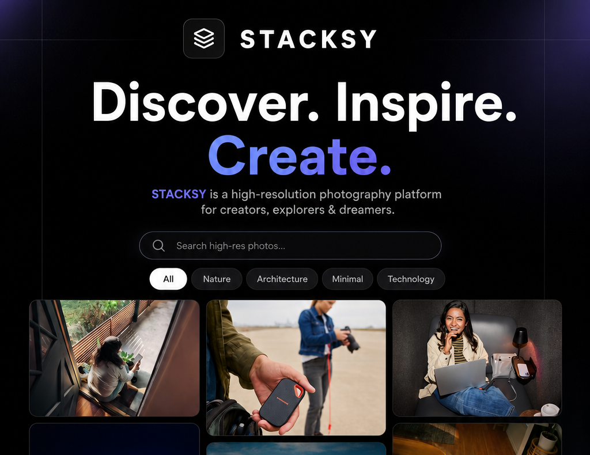

# Stacksy — Real-Time Photo Interaction Gallery



Stacksy is a multi-user, real-time photo gallery where people can browse high-resolution photos, react with emojis, and leave comments — all synced live across every open tab and device. Built as a fun exploration of modern React patterns with a focus on real-time UX.

---

## 🚀 Getting Started

### Prerequisites
You'll need [Node.js](https://nodejs.org/) installed — version 18 or higher works best.

### Installation

```bash
npm install
npm run dev
```

Then open `http://localhost:5173` in your browser. That's it.

---

### 🔑 Setting Up API Keys

The app works right away without any keys — it falls back to a curated local photo library and a mock real-time DB that actually syncs across browser tabs. Pretty handy for a quick demo.

When you're ready to connect real data sources, you have two options:

**Option A — Environment Variables**

Rename `.env.example` to `.env` and fill in your keys:
```env
VITE_UNSPLASH_ACCESS_KEY=your_unsplash_key
VITE_INSTANT_APP_ID=your_instantdb_app_id
```

**Option B — In-App (no file editing needed)**

1. Open the app
2. Click the **Settings gear** at the bottom-right
3. Paste your keys and hit **Save & Reload**

Keys get stored in `localStorage` so you won't need to re-enter them.

---

## 🎨 Design Notes

Styling is based on the [`DESIGN_stacksy.md`](DESIGN_stacksy.md) spec — dark-first, minimal, high-contrast. A few highlights:

- **Font**: Outfit (Google Fonts), aliased to `saans` throughout
- **Color palette**: Slate/charcoal base with white primary text — designed for readability, not decoration
- **Motion**: Micro-animations kept under 200ms so they feel snappy, not distracting. Real-time feed items slide in with a keyframe animation.

---

## 📸 How Photo Fetching Works

Photos come from the [Unsplash API](https://unsplash.com/developers) using `@tanstack/react-query`'s `useInfiniteQuery`.

- **Infinite scroll**: An `IntersectionObserver` watches a sentinel element at the bottom of the grid. When it enters the viewport, the next page loads automatically.
- **Search**: Runs on form submit (Enter or clicking "Find"), not on every keystroke — this keeps things well within Unsplash's rate limits.
- **No key? No problem**: Falls back to 24 hand-picked photos across four categories (Minimal, Nature, Architecture, Technology) with local pagination.

---

## ⚡ Real-Time Layer (InstantDB)

Two entities keep everything in sync across clients:

```typescript
const schema = i.schema({
  entities: {
    reactions: i.entity({
      imageId: i.string(),
      emoji: i.string(),
      username: i.string(),
      userColor: i.string(),
      createdAt: i.number(),
      imageThumb: i.string().optional(),
      imageUrl: i.string().optional(),
      imageAuthor: i.string().optional(),
      imageDesc: i.string().optional(),
    }),
    comments: i.entity({
      imageId: i.string(),
      text: i.string(),
      username: i.string(),
      userColor: i.string(),
      createdAt: i.number(),
      imageThumb: i.string().optional(),
      imageUrl: i.string().optional(),
      imageAuthor: i.string().optional(),
      imageDesc: i.string().optional(),
    }),
  },
});
```

Image metadata (thumbnail, author, description) is embedded directly into each record so the live activity feed can display rich previews without needing extra API calls.

---

## 🧠 A Few React Decisions Worth Noting

**Zustand for UI state** — things like which image is open, active category tab, and search query live in Zustand. It's lightweight and avoids the prop-drilling or context re-render headaches for this kind of volatile UI state.

**Persistent identity** — on first load, the app generates a random CamelCase username (like `CosmicFalcon813`) and a pastel color badge. Both are saved to `localStorage`, so your "identity" survives page refreshes and feels consistent across sessions.

**Event propagation** — emoji quick-reactions on cards call `e.stopPropagation()`. Without this, clicking a reaction would also trigger the card click and open the modal — a subtle but annoying bug to hit.

**Accessible avatar colors** — a luminance formula checks each user's random badge color and automatically picks light or dark text to stay WCAG 2.2 AA compliant.

---

## 💡 Problems Worth Talking About

### The "No API Key" Problem

Most real-time SDKs just crash if you initialize them with a null app ID. Instead of throwing an error or gating the whole app behind configuration, `src/db/client.ts` checks for the key upfront. If it's missing, it swaps in a mock DB backed by `localStorage` that listens to the `storage` event — so real-time sync still works across multiple local tabs, zero config required.

### Feed Item Performance

The live activity feed needs to show "CosmicFalcon reacted ❤️ on [photo]" with a thumbnail. The obvious approach would be fetching photo details from Unsplash when someone clicks a feed item — but that's a whole round trip for something that should feel instant.

The fix: embed the image metadata (thumb URL, author, description) directly inside each reaction and comment record when it's saved. The feed always has everything it needs. No extra API calls, no loading states on click.

---

## 🔮 What I'd Add Next

A few things I'd want to build out with more time:

1. **Explicit optimistic rollbacks** — InstantDB handles some of this automatically, but I'd want proper rollback logic in place for when writes fail mid-connection-drop.
2. **Image uploads** — let users contribute their own photos instead of pulling from Unsplash. A Supabase storage bucket would fit cleanly into the existing architecture.
3. **Reaction confetti** — `canvas-confetti` bursting from the emoji badge on react. Completely unnecessary. Absolutely doing it.
